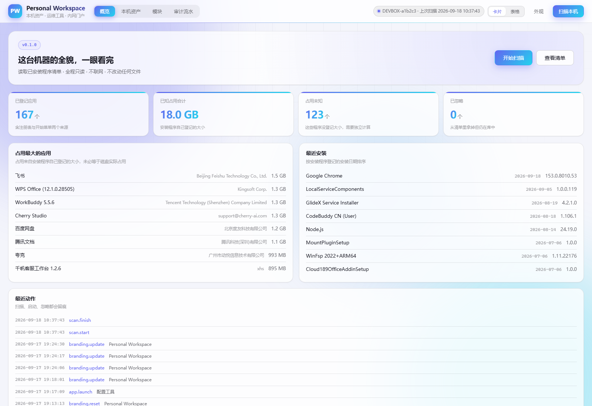
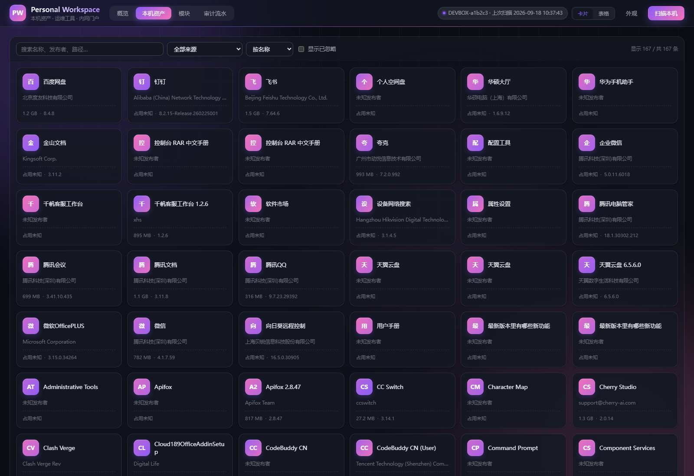
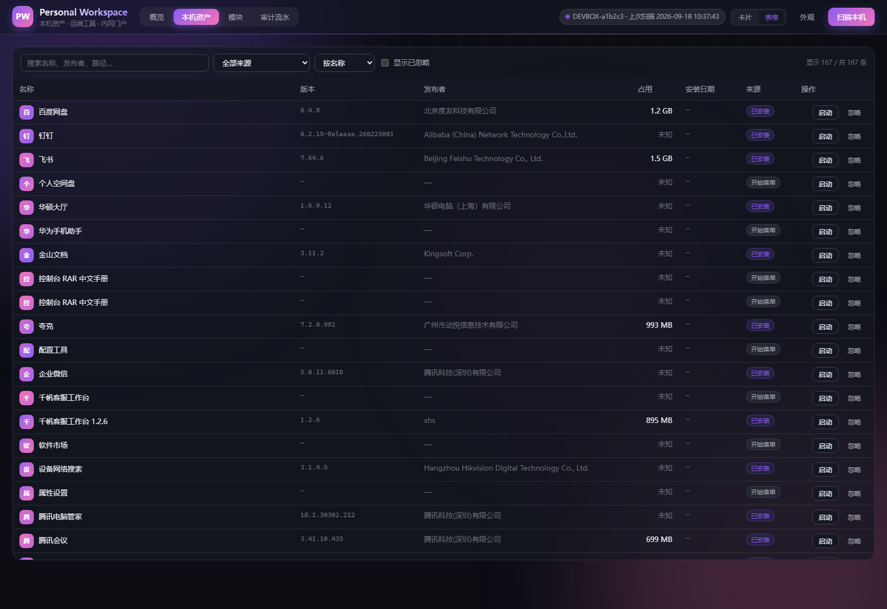
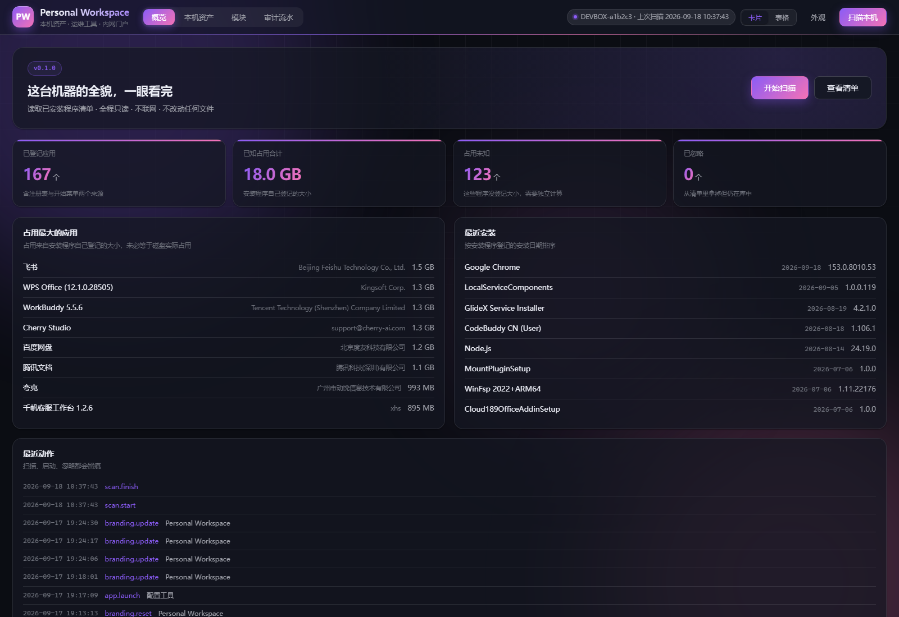
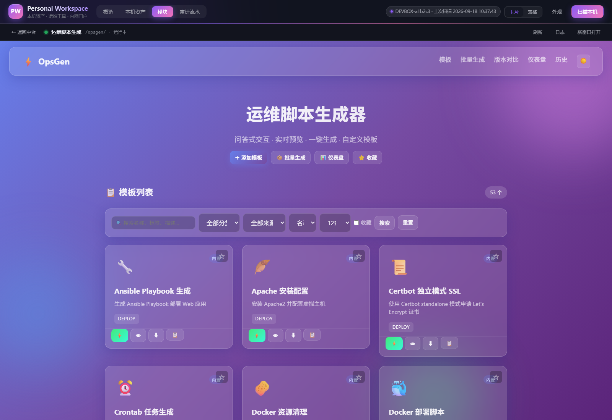
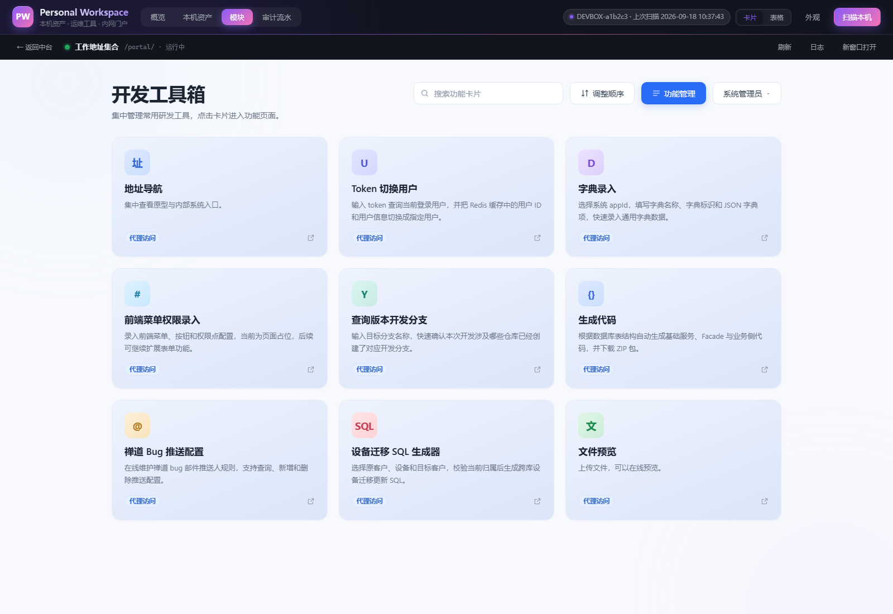
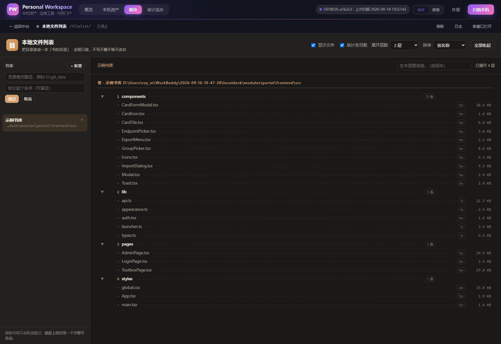

# Personal Workspace

> 一个跑在**自己电脑上**的个人工作台中台。它自己不做业务，只做三件事：
> 把本机资产看清楚、把常用工具收进同一个入口、把散落的能力以模块的形式接进来。

**当前版本：v0.6** · 浏览器打开即用 · 单进程 · 单端口 · 数据不出本机

---

**整体结构** —— 所有东西都从 8731 进来，五个模块挂在同一套鉴权、审计与路径之下：

```
                            浏览器
               （只打开 http://127.0.0.1:8731）
                               │
   ┌───────────────────────────┬──────────────────────────┐
   │ Personal Workspace · 中台内核（单进程）              │
   │ ──────────────────────────────────────────────────── │
   │ 安全边界   Host 校验 · 访问令牌 · 模块票据           │
   │ 平台能力   概览 / 本机资产 / 模块 / 审计 · 外观      │
   │ 模块中枢   声明注册 · 生命周期 · 反代 · 路径改写     │
   └───────────────────────────┬──────────────────────────┘
                               │
        ┬              ┬              ┬              ┬              ┬
        │              │              │              │              │
┌───────────────┐┌───────────────┐┌───────────────┐┌───────────────┐┌───────────────┐
│ 模块一        ││ 模块四        ││ 模块五        ││ 模块二        ││ 模块三        │
│ 本机资产清单  ││ 本地文件列表  ││ 日志可视化分析││ 运维脚本生成  ││ 工作地址集合  │
│ /inventory    ││ /filelist     ││ /logviz       ││ /opsgen       ││ /portal       │
│ native 同进程 ││ native 同进程 ││ native 同进程 ││ 子进程 :8732  ││ 子进程 :8733  │
│ （无端口）    ││ + 自带页面    ││ + 自带页面    ││ + 反向代理    ││ + 反代 + 网关 │
└───────────────┘└───────────────┘└───────────────┘└───────────────┘└───────┬───────┘
                                                                 │
                                       ┌─────────────────────────┘
                                       │
                    ┌──────────────────┬─────────────────┐
                    │ 内网系统（Jenkins / ES / …）       │
                    │ 浏览器到不了，由中台代为转发       │
                    └────────────────────────────────────┘
```

---

## 一、定位

这不是一个"功能集合"，而是一个**框架**。

运维和开发每天要面对的东西是散的：一堆内网系统地址、一堆随时要重写的脚本、一堆装了但想不起来占了多少空间的程序。
它们的共同问题是**没有统一入口**——于是每个都变成一条书签、一个文件夹、一段复制粘贴的历史记录。

Personal Workspace 要解决的就是这一层：**提供统一入口、统一鉴权、统一数据层、统一审计**，
让具体能力以模块的形式挂进来，而不是各自为政地再起一个服务、再记一个端口。

它明确**不做什么**：

| 不做 | 原因 |
|---|---|
| 不做文件整理 / 清理 | 归档是"看清楚"，不是"帮你动"。删除、移动、改名一律交回用户手工执行 |
| 不做远程访问 | 只监听 `127.0.0.1`，局域网里的其它设备连不上，这是硬约束不是默认值 |
| 不做云端同步 | 零网络上传。它不需要联网才能工作，也不会偷偷往外发数据 |
| 不提供任意命令执行 | 只有「用系统默认程序打开已存在的路径」和「打开网址」两种动作 |

## 二、理念

四条主张，贯穿所有实现细节。有冲突时按这个顺序取舍。

**1. 本地优先。** 数据放在自己的磁盘上，服务只监听回环地址，备份就是拷一个文件。
不是"顺手也支持本地"，而是"只能本地"——一个能管理你整台电脑的程序，不该有第二个副本活在别人的服务器上。

**2. 只读优先。** 能看清楚的事情，绝不顺手动手。扫描全程只读注册表、不移动不删除不改名任何文件。
"整理"是个危险词：程序永远比你更不清楚哪个文件还有用。

**3. 框架优先于功能。** 中台的价值在于**接得进新东西**，不在于功能多。
所以先把模块接入规范定下来（四种接入形态、统一鉴权、子进程生命周期），再往里填功能。
功能可以慢慢加，接口定错了要推倒重来。

**4. 外观归用户。** 名字、配色、Logo、背景图都由用户定，因为这是你的工作台，不是别人的产品。
所以首页的品牌信息是**可配置**的，而不是写死在代码里的字符串。

## 三、设计思路

几个关键决策，以及为什么这么做（完整版见 [`docs/ARCHITECTURE.md`](docs/ARCHITECTURE.md)）。

### 为什么是单端口，不需要 Docker 和虚拟机

中台对外**只暴露一个端口**（默认 `8731`）。模块在内部各自监听回环端口，由中台统一转发，用户完全无感。

于是：不需要为每个模块开放端口、不需要 docker-compose、不需要在虚拟机里再维护一套环境、
不需要处理模块之间的鉴权传递。一个进程启动，一个地址访问。

### 为什么前端零构建

`web/` 下就是三个文件：`index.html`、`style.css`、`app.js`。没有 Vite、没有 `node_modules`、没有构建产物。

理由很实际：**一个本地小工具，不该要求使用者先装 Node 再跑一次 build。**
改完刷新浏览器就生效，三年后回来看还能直接改，不会被一套过期的构建链卡住。

代价是写起来啰嗦一些（没有 JSX、没有组件），换来的是"永远能跑"。

### 为什么数据库是单个 SQLite 文件

不用 ORM、不用外部数据库服务。表结构在 `backend/app/migrations/*.sql` 里是纯 SQL，按文件名顺序执行，执行过的记在 `_migrations` 表里。

手写 SQL + 显式迁移，比 autogenerate 更可控：**三年后回头看，能一眼看出表是怎么变过来的。**

### 为什么重扫要幂等，而且绝不覆盖用户字段

扫描是重复动作，用户会点很多次。所以：

- 唯一键是 `(source, source_key)`：同一个来源的同一条记录，重扫只更新、不新增（扫十次也只有一份清单）
- 重扫**只更新客观元数据**（名称、版本、发布者、大小、安装日期）
- **用户字段一个字都不动**（别名、标签、分组、收藏、忽略）——否则你整理好的分类，会被下一次扫描抹平

### 为什么令牌走请求头而不是 Cookie

Cookie 会被**同源的其它页面自动携带**。如果令牌在 Cookie 里，你在浏览器里误开一个恶意页面，它就能直接调本机的接口。

放在请求头里，对方必须显式构造请求才带得上——门槛高得多。
配套还校验 `Host` 头，用来挡 **DNS rebinding**（攻击者把自己的域名解析到 `127.0.0.1`，诱导浏览器同源访问）。

### 那「打开一次就记住」是怎么做的

令牌那么难用（每次都要从启动窗口复制），所以**浏览器**这条路另外加了一层会话：

1. `start.bat` 打印的访问地址里带着令牌，页面拿它换一条会话
2. 服务端回一个 `HttpOnly` + `SameSite=Strict` 的 Cookie —— **里面装的是随机会话号，不是令牌**
3. 之后直接开 `http://127.0.0.1:8731` 就能进，默认 30 天不必再输

两条通道各管各的：脚本、curl、模块之间的调用**照旧用令牌请求头**（`X-LocalDeck-Token`），一个字符都没变。

会话号泄露的后果比令牌小得多：它只能在 `localdeck.db` 里兑出权限，随时能在顶栏点「退出」注销。
而且库里存的是会话号的 **sha256**，光拷走 db 也登不进来。

> 换过数据目录、删过 `data/.token`、或点过「退出」，旧凭据都会失效 —— 这时回 `start.bat` 窗口拿当前那条地址即可。
> 换浏览器、清了 Cookie 也一样，页面会弹一个登录窗，把那条地址整条粘进去就行。

### 出问题先看日志

服务在跑的时候，所有事都记在 `data/logs/localdeck.log` 里：

```
2026-09-18 16:53:43.118 [INFO ] localdeck: 启动中台 Personal Workspace v0.6.0｜机器 DEVBOX-a1b2c3｜端口 8731｜…
2026-09-18 16:53:43.763 [WARNING] localdeck.http: 401 GET /opsgen/ —— 第三方模块路径不认浏览器会话，需要令牌或模块票据
2026-09-18 16:53:44.021 [INFO ] localdeck.http: GET /api/overview -> 200  81ms
```

- 每条请求都有：方法、路径、状态码、**耗时**
- 401 会写清**是哪个环节不对**（没带凭据 / 令牌不符 / 会话过期 / 票据是上一轮的），不用再猜
- 记的是**路径**不是完整 URL，参数只记名字不记值 —— 免得不小心把凭据写进日志
- 轮转保留 14 个文件、每个 20MB（最多 280MB），不会把磁盘吃满

## 四、五个功能模块

| # | 模块 | 定位 | 接入形态 | 对外路径 |
|---|---|---|---|---|
| 1 | **本机资产清单** | 只读 + 归档：看清这台机器装了什么、占多少、从哪来 | `native` 同进程挂载（不起进程、不占端口） | `/inventory/` |
| 2 | **运维脚本生成** | 问答式生成部署 / 诊断 / 备份 / 清理脚本（集成第三方 OpsGen） | `subprocess_proxy` 子进程 + 反代 | `/opsgen/`（内部 8732） |
| 3 | **工作地址集合** | 内网系统导航门户 + 反向代理网关；挂在中台后面时免登录 | `subprocess_proxy` 子进程 + 反代 | `/portal/`（内部 8733） |
| 4 | **本地文件列表** | 把本机目录读成一本「书的目录」，全程只读 | `native` 同进程挂载，自带页面 | `/filelist/` |
| 5 | **日志可视化分析** | 把日志读成一份可下钻的报告：时间分布、构成、Top 榜单 | `native` 同进程挂载，自带页面 | `/logviz/` |

「接入形态」那一列的取值见下面「模块怎么接进来」；每个模块的细节见各自的小节。

### 模块怎么接进来

顶栏「**模块**」标签页是模块的集散地：状态灯、启停、重载声明、看日志都在那。

模块放在 `modules/<id>/`，用一句 `module.py` 声明自己怎么接入，中台负责其余全部事情
（拉起进程、探活、反代、路径改写、凭据隔离、审计）。**第三方模块一行源码都不用改**。

四种接入形态：`native`（同进程挂 Router）/ `static`（托管前端产物）/
`subprocess_proxy`（子进程 + 反代，第三方模块的首选）/ `external`（模块自己启动，中台只反代）。

完整的接入规范、字段说明与排障手册见 **[docs/MODULES.md](docs/MODULES.md)**。

### 模块一：本机资产清单

扫描注册表（HKLM 64 位 / HKLM 32 位 / HKCU 三处都读，少一处就会漏掉大量程序）与开始菜单，
登记已安装程序、版本、发布者、占用、安装日期；支持搜索、排序、卡片/表格双视图、启动、忽略。

本机实测：**167 条记录、已知占用 18.0 GB、单次扫描约 340 ms**。

**只读 + 归档是刻意的边界**：不移动、不删除、不改名任何文件。

它原先长在内核里（`backend/app/controllers/apps.py` + `services/`），已迁成独立模块
`modules/inventory/`。接口前缀仍是 `/api/apps`，只是多了一层 `/inventory` 命名空间：

| 迁前 | 迁后 |
|---|---|
| `/api/apps` | `/inventory/api/apps` |
| `/api/apps/scan` | `/inventory/api/apps/scan` |

**表结构与数据一字未改**，仍写同一个 `localdeck.db`（模块自己开连接，通过中台注入的
环境变量拿到库路径，因此不必 import 中台的包）。对外行为零变化。

它是唯一**同进程挂载**（`kind=native`）的模块 —— 没有自己的端口，路由直接进中台的应用；
它的界面也仍然住在中台的「本机资产」标签页里（比模块机制更早存在），
模块挂载点的根路径给的是一个说明页而不是第二套界面。

### 模块二：运维脚本生成（OpsGen）

问答式交互生成运维脚本，内置 51 个 YAML 模板，覆盖部署、备份、诊断、维护、安全五大类。

通过中台的 `subprocess_proxy` 接入：中台用它自己的启动壳起 OpsGen 的进程，再把
`/opsgen/*` 反代过去。上游那份 `app.py` 里的 `host="0.0.0.0"` 和 `debug=True`
**一个字都没改**——中台是绕过它的 `__main__` 分支、自己接管监听地址的。

> **第三方来源声明**
>
> 本模块集成 **[MMCISAGOODMAN/OpsGen](https://github.com/MMCISAGOODMAN/OpsGen)**，原作者 **MMCISAGOODMAN**。
>
> - 上游许可：**MIT**（说明：上游仓库当前**未附 LICENSE 文件**，许可信息来自其 README 的声明）
> - 集成版本：`e1771c1e139ae5d7a63c16db5c4fbaead6b7c2db`（2026-06-12）
> - 源码位置：`modules/opsgen/`，**原样保留、未作修改**，便于后续与上游同步
> - 上游未提供任何担保；二次分发时请一并保留本声明与上游 README

#### 接进来时被关掉的两个能力

| 能力 | 默认 | 为什么 |
|---|---|---|
| **在线执行脚本**（OpsGen 的 socket.io 实时通道） | **关闭** | 它在服务端把脚本写进临时文件然后 `bash` 执行 —— 等于给浏览器开了一个任意命令执行入口。中台的安全边界里写明「不提供任意命令执行」。关掉后生成的脚本照常复制/下载，点「在线执行」会明确告诉你为什么不行 |
| **外部 CDN 资源**（highlight.js 代码高亮、socket.io 客户端） | **剥离** | 对应「零网络上传、无遥测」。代价是代码块失去配色，功能不受影响 |

两项都可以在 `modules/opsgen/module.py` 里单独打开（`allow_realtime` /
`allow_external_assets`），改完在中台点「重载声明」+「重启」即可。打开后会在模块日志里留痕。

### 模块三：工作地址集合

把内网各个系统（Jenkins、Grafana、ES、Confluence 等）做成卡片，点开即用；
跳板机场景下浏览器直接访问不到的内网地址，由网关代为转发，并做 HTML / CSS 字节级路径重写。

支持**一张卡片挂多个环境地址**（生产 / 测试 / 开发归档）、拖拽排序、表格化导入导出。

它自带登录体系，但**从中台访问时不再要求登录**：中台本身已经把边界做全了
（只绑 127.0.0.1 + Host 校验 + 访问令牌），再让自己在自己的机器上敲一遍密码是重复劳动。
免登录的凭据不是随便一个请求头 —— 中台转发时会带上 `X-LocalDeck-Module-Ticket`
（值是本模块自己的票据，每次运行新生成），模块侧要求「开关打开 + 来源回环 + 票据一致」
三条同时成立。**独立运行（不经中台）时该开关不存在，只能正常登录** ——
免登录的正当性完全来自上游那道边界，边界不在就不能免。

它是第一个走「中台 → 模块 → 内网」两层代理的模块，为此给内核补了三件事
（都在 `backend/app/services/modules/` 下）：

| 补的东西 | 为什么 |
|---|---|
| `runners/asgi_app.py` | 模块是 FastAPI（ASGI），原有的 Flask 启动壳不适用。监听地址写死在壳里，模块无权决定 |
| `allow_module_cookies` | 不放行模块自有会话，它连登录都登不上（登录刚发的 Cookie 下一个请求就被剥掉了） |
| `basename` + `pushState` 补齐 | 前端用 `BrowserRouter`，挂到 `/portal/` 下要摘掉前缀再匹配，否则页面空白 |

**这里踩到并修掉了一个真问题，值得记一笔**：中台代理用的是**一个长期存活、被所有模块共用**的
HTTP 客户端，而它默认会把响应里的 `Set-Cookie` 存进自己的 Cookie 罐，之后自动附加到后续请求。
Cookie 的作用域只看域名、**不看端口**，而中台所有模块都在 `127.0.0.1` 上，于是——

- 「谁在 `/portal/` 登录过一次」会变成「此后**任何**不带 Cookie 的请求都带着那份会话」；
- 更进一步，A 模块的会话会被原样送给 B 模块，凭据隔离形同虚设。

实测确认：零 Cookie 访问 `/portal/api/auth/me` 曾返回 **200 + 管理员身份**。
现在代理客户端被显式关掉了 Cookie 罐，并且加了一道不变量校验兜底
（出站请求能带的 Cookie 名字集合必须恰好等于本次请求该带的那一份，多一个就拒发）。
自检脚本里有对应断言，见 `docs/MODULES.md` 第十二节。

### 模块四：本地文件列表

把目录读成一本**书的目录**：分卷、分章、层级编号（1 / 1.1 / 1.1.1）、点线引导，
后面跟着条目数与占用大小。资源管理器那种一行一条的列表看不出层级全貌，
也不知道"这一卷有多厚"；目录页一眼就能扫完。

- **书库**：自己登记要看的根目录（首次运行给一个主目录作起点），可改名、可移出。
  移出只是取消登记，**磁盘上的目录一个字都不会动**
- **编号规则**：目录才是章。同级第 n 个目录编成 `n`，它的子目录就是 `n.1`、`n.2`…
  文件不编号，作为叶子排在同级目录后面 —— 书目录本来就长这样
- **懒加载**：点一层读一层，不预取整棵子树
- 「算厚度」按需递归统计某个目录的总占用（有时间与条目预算上限，超了会如实标注）

**⛔ 只读边界（这条不许放宽）**：不写、不删、不移、不改名任何文件；没有下载、
没有打开文件、**不读文件内容**、没有命令执行。路径全部做包含性校验 ——
`..`、绝对路径、盘符一律拒收，**而且解析后要再比对一次**，因为根目录里一个指向
外面的 junction / 符号链接能把整条路径带出去。

### 模块五：日志可视化分析

**日志文件不该用眼睛逐行读。** 一份几万行的 nginx access 日志里真正要看的可能就三件事：
哪个 URL 最慢、哪些请求在报错、出错的时间点集中在哪。这个模块先把日志**认成一份报告**，
再让每个指标都能**点回原始行** —— 看到"14:03 有 37 个 500"能立刻跳到那 37 行去看。

先做三类（识别不了的类型会如实说认不出，不硬猜）：

| 类型 | 认什么 | 报告里给什么 |
|---|---|---|
| **nginx access** | 通用格式 / 带 `$request_time` 的 main 格式 | 请求量、状态码分组（2xx/3xx/4xx/5xx）、**按耗时排序**的 Top URL、客户端与 UA 构成、时间分布 |
| **Java 应用日志** | Spring Boot 常见排版（`2026-09-18 12:33:39.123 ERROR 12345 --- [thread] logger : msg`） | 级别构成、异常类型 Top、logger Top、**归并后的消息 Top**、时间分布 |
| **MySQL 慢查询** | `mysqldumpslow` / 官方 slow log 的块结构 | 慢查询条数、扫描行数合计、**按耗时排序**的 SQL 模板 Top、按库分布 |

三个设计上的选择，说明一下为什么这么做：

- **异常栈要合并，不能一行算一条。** 一段 `NullPointerException` 往往跟着十几行 `at ...`，
  逐行统计会把"1 次异常"记成"14 条记录"，Top 榜立刻失真。Java 解析器按"新记录起始行"
  切分，续行挂到上一条身上。
- **同一错误的不同变体要归并。** `下单失败 orderId=88213` 和 `orderId=99001` 是同一个问题，
  不归并的话 Top 榜会被同一类错误刷屏。做法是先把易变的部分（时间戳、UUID、IP、长数字…）
  换成占位符再统计，而**榜单的排序依据是出现次数**。
- **MySQL 慢查询是块结构，不是行结构。** 一条慢查询跨 `# Time:` / `# User@Host:` /
  `# Query_time:` / SQL 正文好几行（SQL 本身还可能多行），必须按块切开。

**每个指标都能下钻**：榜单上的数字点一下，右侧抽屉里就是命中它的原始行，带行号、
命中处高亮。前面说的两个坑（栈合并、变体归并）在这里最容易翻车 ——
"榜上有 2 次、点下去 0 行"就是归并口径和查找口径不一致导致的，
所以自检脚本里专门有一组「下钻可达性」断言盯着它。

**⛔ 只读边界**：日志文件全程只读 —— 不开写模式、不删、不移、不改名。可读范围**限于你登记的
日志根目录**，`..` / 绝对路径 / 盘符一律拒收，与模块四同一套包含性校验。

**扫描有预算**：单文件最多读 200 MB / 200 万行 / 20 秒，到顶会如实标注「已截断」而不装作读完了。
分析摘要缓存在模块自己的 `data/logviz.db` 里，缓存有效性看**路径 + 大小 + mtime + 类型**四样，
文件一变缓存自动作废 —— 不存在"日志更新了但报告还是旧的"。

## 五、外观由你决定

页面右上角「**外观**」按钮打开设置面板。**改动即时预览，点「保存」才写进配置**，没保存就关掉会自动还原。

| 能改什么 | 说明 |
|---|---|
| **平台名称** | 顶栏与浏览器标签页标题，最长 32 字 |
| **副标题** | 名称下面那行小字，最长 48 字 |
| **Logo 文字** | 左上角方块里的字（最多 4 个字符），同时用于标签页图标 |
| **Logo 图片** | 上传后盖住 Logo 文字，上限约 620 KB |
| **页面背景图** | 整页背景，可调「背景蒙层」浓度保证文字可读，上限约 1.2 MB |
| **背景样式** | 光晕（可动的彩色光斑）/ 网格 / 纯色 |
| **主题预设** | 极光、深海、日落、森绿、紫罗兰、石墨 —— 一键换主副色 |
| **明暗模式** | 浅色 / 深色。切到深色时，如果你没改过底色，会一并换成深色默认值 |
| **配色取色器** | 主色 / 副色 / 底色 / 面板色 / 文字色，全部独立可调 |
| **恢复默认** | 一键回到出厂外观 |

两个实现上的细节，说明一下为什么这么做：

- **配色只在服务端注入 5 个基色**，其余派生色（浅色底、描边、发光）全部由 CSS 的 `color-mix()` 现算。
  所以拖取色器时整页配色会实时跟着变，而不只是改了几个按钮。
- **图片以 data URL 存在数据库里**，不落地成图片文件。这样"备份 = 拷一个 `localdeck.db`"这条承诺仍然成立。

> 内部标识（令牌请求头 `X-LocalDeck-Token`、数据库文件名、目录名）**不随品牌改名而变**。
> 这三样一旦跟风改，已有数据和你浏览器里的书签就全废了。它们不出现在界面上，可以忽略。

## 六、界面长什么样

四块主场，按顶栏标签页分：

| 标签页 | 里面是什么 |
|---|---|
| **概览** | 指标卡（已登记数 / 已知占用 / 占用未知 / 已忽略）、占用 TOP 8、最近安装、审计流水。首屏是一句"这台机器的全貌，一眼看完"，右上角给一个扫描按钮 |
| **本机资产** | 同一份数据的两种看法：卡片视图（按分组铺开，适合扫一眼）与表格视图（适合排序比对），视图偏好记在本地。支持搜索、按来源筛选、按名称/大小/安装时间排序、收藏、忽略、写备注 |
| **模块** | 每个模块一张卡：接入形态、对外路径、内部端口、PID、运行状态、日志尾部，以及启用/停止/重启/重载声明。被关掉的能力也会如实标注（比如「实时通道未放行」），而不是等用户点了才发现 |
| **审计流水** | 每一次扫描、启动、改配置、启停模块都留一条，带时间、动作、目标、客户端 IP |

**概览 · 浅色（极光预设）** —— 指标卡、占用 TOP、最近安装、审计流水



**本机资产 · 卡片视图** —— 按发布者分组铺开，一眼看全



**本机资产 · 表格视图** —— 切到表格后是同一份数据，便于排序比对



**概览 · 深色（紫罗兰预设）** —— 换明暗模式和预设后，光晕、渐变条、按钮、数字、Tab 滑块整套跟随



### 模块机制

**模块面板** —— 接入形态、对外路径、内部端口、PID 都摊开写；
被关掉的能力（实时通道）也如实标注


**模块二 · 运维脚本生成** —— OpsGen 在 iframe 里跑。注意地址栏仍是中台的 8731，
`/opsgen/` 是唯一对外路径；模板列表、静态资源、接口调用全部经中台改写转发



**模块三 · 工作地址集合** —— 自带界面、自带网关，挂在中台后面时免登录。
界面上看到的是全新安装时的示例卡片（真实地址由使用者自己维护）



**模块四 · 本地文件列表** —— 把目录读成一本「书的目录」：分章编号、点线引导、
条目数与占用大小。全程只读



### 外观整套可调

界面没有写死的配色：顶栏右侧「外观」按钮可以改平台名称、副标题、Logo（文字或图片）、
页面背景图、主题预设（极光 / 深海 / 日落 / 森绿 / 紫罗兰 / 石墨）、明暗模式，
以及五个基色的取色器。**改动即时预览，点保存才落盘**，没保存就关掉会自动还原。

## 七、快速开始

```
双击 start.bat
```

首次运行会自动建私有运行环境、装依赖、起服务、开浏览器。关掉命令行窗口即停止服务。

> 前提：本机有 Python 3.11+。没有的话脚本会提示下载地址，安装时记得勾选 **Add python.exe to PATH**。
>
> 界面用到 CSS `color-mix()`，需要 Chrome / Edge 111+ 或 Firefox 113+。
> 老浏览器不会白屏，只是配色会退回一套静态兜底色。

### 克隆之后第一次运行

直接双击 `start.bat` 即可，引导脚本会自己建环境、装依赖。

**只有一个例外**：模块三（工作地址集合）的前端产物**不进版本库** —— 它是构建结果，
提交它等于把编译产物当源码管。所以全新克隆下来的第一次启动，那个模块会出现
「进程起来了、健康检查也过了，页面却是空的」。

引导脚本会**自己检测到并打出该跑的命令**，照着做一次就行：

```
cd modules\portal\frontend
npm install
npm run build
```

需要 Node 20+，只在这时候用得到。构建产物留在本地，之后的 `git pull` 不会覆盖它
（除非上游改了前端源码 —— 那时 `npm run build` 再来一次）。

其余四个模块都不需要构建：模块一、模块四、模块五没有前端构建产物（页面是手写的
`web/` 下三个文件，改完刷新即生效），模块二是第三方源码原样托管。

### 数据放在哪（含"备份 = 拷一个文件"）

| 位置 | 内容 |
|---|---|
| `data/localdeck.db` | 中台主库：本机资产清单、任务历史、审计流水、外观配置（品牌图以 data URL 存在库里） |
| `data/.token`、`data/.machine` | 访问令牌、机器标识 |
| `data/logs/` | 运行日志（按 20MB × 14 个轮转，随时可以整个删掉，不影响功能） |
| `modules/portal/data/` | 模块三的门户库（卡片、账号、审计） |
| `modules/filelist/data/` | 模块四的书库配置（登记的根目录，一个小 json） |
| `modules/logviz/data/` | 模块五的日志根目录登记 + 分析摘要缓存（`logviz.db`） |
| `modules/opsgen/data/` | 模块二的自定义模板、历史、分享 |

备份就是把这几个目录拷走；**SQLite 要连 `-wal`、`-shm` 一起拷**
（主库文件可能很小、内容还在 WAL 里，只拷 `.db` 会丢数据）。

这几个目录都在 `.gitignore` 里 —— 里面既有你的真实数据，也可能含内网地址。

### 为什么 start.bat 只有二十来行

`start.bat` 刻意做成一个**纯 ASCII、CRLF 行尾、不带括号块**的骨架，真正的流程都在
`scripts/bootstrap.py` 里。这不是洁癖，是踩出来的：

cmd.exe 解码 `.bat` 用的是控制台代码页，而且它对行尾很敏感。**UTF-8 无 BOM +
LF 行尾 + 中文注释**这三样凑在一起时，它会算错行偏移，把注释里的词当成命令去
执行 —— 实测报出过 `'newer:'`、`'Then'`、`'See'` 不是内部或外部命令，而报错的
位置和真正出问题的行毫无关系，看报错根本无从下手。

所以规矩定死：**`.bat` 里不写中文、不用 LF 行尾、不写括号块**。要加提示就加进
`bootstrap.py`（那边中文正常，而且逻辑可测 —— `--modules-only` 是不启动服务的
纯逻辑入口）。代码页也由 Python 自己设，不靠 bat 里的 `chcp`：chcp 之后 cmd 重读
批处理文件时同样可能算错偏移，那正是要躲开的坑。

日常操作、排查、模块扩展见 [`docs/RUNBOOK.md`](docs/RUNBOOK.md)。

### 深链接

可以把某个视图直接存成书签：

```
http://127.0.0.1:8731/?tab=apps&view=table     # 直接打开本机资产的表格视图
http://127.0.0.1:8731/?tab=modules             # 直接打开模块面板
http://127.0.0.1:8731/?tab=audit               # 直接打开审计流水
http://127.0.0.1:8731/?tab=modules&module=filelist   # 直接打开某个模块
```

`tab` 取 `overview` / `apps` / `modules` / `audit`，`view` 取 `grid` / `table`，
`module` 填模块 id（`inventory` / `filelist` / `opsgen` / `portal`）。
URL 里的 `view` 只影响本次打开，不会改掉你存在本地的默认视图偏好。

## 八、安全设计

| 措施 | 防的是什么 |
|---|---|
| 只监听 `127.0.0.1` | 局域网内其它设备无法访问 |
| 校验 `Host` 头 | **DNS rebinding** —— 外部域名解析到 127.0.0.1 后诱导浏览器同源访问 |
| 访问令牌走请求头 | 浏览器中误开的其它页面无法直接调接口（Cookie 会被自动携带，所以**令牌**不进 Cookie） |
| 浏览器会话单列一条通道 | 会话 Cookie 里装的是随机会话号（不是令牌），而且**只有 native 模块认它** —— 第三方模块页面借不到中台级权限 |
| 免令牌接口按「路径 + 方法」放行 | 读配置可以放开，写配置必须带令牌 —— 同一个路径两种待遇 |
| 品牌图只收位图、拒收 SVG | SVG 能内嵌脚本，少一个可以被绕的入口 |
| **零网络上传** | 中台自身不发起任何外部请求 |
| 扫描全程只读 | 不写注册表、不移动、不删除、不改名任何文件 |
| 不提供任意命令执行 | 只允许「用系统默认程序打开已存在的路径」和「打开网址」 |
| **模块的内部端口只绑 `127.0.0.1`** | 局域网内任何人都到不了，绕不过中台的鉴权与审计 |
| **模块监听地址由中台接管** | 上游代码里常见的 `host="0.0.0.0"` / `debug=True` 会被绕开，且**不改上游源码** |
| **模块用独立的凭据** | 模块是第三方代码，给它中台令牌等于把 `/api/*` 全交出去。改用只对本模块路径有效的票据 |
| **中台令牌不进 URL、不进 Cookie** | 模块路径下连 `?token=` 都拒收 —— URL 查询串是第三方脚本读得到的地方 |
| **模块的实时通道默认阻断** | 那条通道上通常挂着「在服务器上执行脚本」，即任意命令执行入口 |
| **外部 CDN 资源默认剥离** | 保持「不联网也能用」；代价通常只是代码块少了配色 |
| **中台代理不在服务端记会话** | 共用的 HTTP 客户端一旦自带 Cookie 罐，就会出现「零 Cookie 也能拿到别人的登录态」以及「A 模块的会话串给 B 模块」。已显式关掉，并加了一道不变量校验兜底 |
| **免登录的模块有可验证的凭据** | 挂在中台后面时可以免登录，但凭据不是可伪造的请求头，而是每次运行新生成的模块票据（回环来源 + 票据一致才放行）；**独立运行时该开关不存在，只能正常登录** |
| **文件列表模块只读且限定范围** | 不写、不删、不移、不改名；根目录由用户显式登记，路径做包含性校验（`..` 与指向范围外的符号链接 / junction 一律拒收，且越界条目连元数据都不读） |
| 模块会话 Cookie 收进模块路径 | 模块的 Cookie 不会跟着发给中台的 `/api/*` |
| 转发前独立校验路径 | 拒绝 `..`、反斜杠与非法字符，不寄望于「上游不会构造奇怪的路径」 |

**已知残余风险**：模块的 iframe 与中台首页同源（都是 `127.0.0.1:8731`），
所以模块脚本理论上能碰到父页面的东西。这是「单一入口」的天然代价，不是实现疏漏。

浏览器会话上线后，这条要补一句：模块页面里的脚本**可以借浏览器之手**去调中台的
`/api/*` —— 会话 Cookie 会被同源请求自动带上，`HttpOnly` 只挡得住"读值"，挡不住"被带出去"。
能做的都做了：第三方模块路径**一律不认会话**（只认令牌与模块票据），只有 native 模块认；
但「同源页面能不能调 `/api/*`」在协议层没有解法。

不过它比改动**之前更轻**了：以前中台令牌存在 `sessionStorage` 里，而 `sessionStorage`
按源隔离 —— 同源的模块页面**可以直接把令牌读出来**，带在身上去任何地方用。
换成会话 Cookie 之后，令牌不再落进浏览器：读不到，只能"借手"，而且顶栏一键就能注销。

处理方向（来源隔离）与决策时机见 `docs/ARCHITECTURE.md` 第四节。

## 九、数据

全部在 `data/` 下：

| 路径 | 内容 |
|---|---|
| `data/localdeck.db` | 中台主库（资源 / 任务 / 审计 / 品牌外观配置） |
| `data/module-logs/<模块>.log` | 各模块的 stdout/stderr（进程被打断也能翻） |
| `data/portal/devtoolbox.db` | 模块三的库（卡片配置） |
| `data/opsgen/` | 模块二的自定义模板、历史、分享 |
| `data/.token` `data/.machine` | 访问令牌与机器标识 |

模块自己的数据落在**它自己的目录下**（`modules/<id>/data/`），中台不越权读写。

**备份要连 `-wal`、`-shm` 一起拷**；正常 Ctrl+C 关停会自动合并，强杀进程则不会。

## 十、目录结构

```
localdeck/
├── start.bat                  唯一入口（二十来行 ASCII 骨架，逻辑全在 scripts/）
├── scripts/
│   ├── bootstrap.py           ★ 启动引导：建环境 → 装依赖 → 准备模块 → 起服务
│   └── setup-modules.bat      只准备模块环境（同样只是个骨架）
├── backend/                   中台内核
│   └── app/
│       ├── main.py            装配：内核 + 模块注册 + 首页品牌注入
│       ├── config.py          路径/端口/令牌收口
│       ├── security.py        统一鉴权（Host + 令牌 + 浏览器会话 + 模块票据 + 免令牌白名单）
│       ├── migrations/        内核表结构（纯 SQL，按序执行）
│       ├── controllers/       内核接口（含模块代理的兜底入口）
│       ├── services/
│       │   ├── modules/       ★ 模块接入内核
│       │   │   ├── spec.py        模块怎么声明（纯数据）
│       │   │   ├── registry.py    有哪些模块、现在什么状态（纯内存）
│       │   │   ├── supervisor.py  起进程 / 探活 / 按进程树回收
│       │   │   ├── rewrite.py     路径改写规则（纯函数，可单测）
│       │   │   ├── proxy.py       HTTP 转发与凭据隔离
│       │   │   ├── hub.py         把上面几个拼起来挂到 FastAPI
│       │   │   ├── runners/       中台提供的启动壳（接管监听地址）
│       │   │   └── assets/pathfix.js  注入进模块页面的路径垫片
│       │   └── branding.py       品牌与外观配置
│       └── repositories/      数据访问（event/task 写入 + 概览读取）
│   └── scripts/
│       ├── check_modules.py   模块内核自检（按模块分组，共 107 项断言，需要服务在跑）
│       ├── check_auth.py      鉴权边界自检（令牌 / 会话 / 票据三条通道，不需要服务在跑）
│       └── check_docs.py      文档交叉核对（以代码为事实来源，防止文档里的数字变旧）
├── web/                       内核前端（零构建，改完刷新即生效）
├── modules/                   功能模块（可插拔）
│   ├── inventory/             模块一：本机资产清单（native，同进程挂载）
│   ├── filelist/              模块四：本地文件列表（native，自带页面）
│   ├── logviz/                模块五：日志可视化分析（native，自带页面）
│   ├── opsgen/                模块二：第三方 OpsGen 源码 + module.py 声明
│   └── portal/                模块三：工作地址集合（内网门户 + 网关）
├── docs/
│   ├── ARCHITECTURE.md        架构决策
│   ├── MODULES.md             ★ 模块接入规范与排障手册
│   ├── RUNBOOK.md             运行手册
│   └── screenshots/           界面实拍（文件名用 pw-<版本>-* 语义前缀）
├── data/                      运行时数据（不进版本库）
├── LICENSE                    Apache License 2.0 全文
└── NOTICE                     版权声明 + 第三方组件声明（Apache 约定）
```

## 十一、当前状态

| 部分 | 状态 |
|---|---|
| 中台内核 · 数据层 / 鉴权 / 审计 | ✅ 可用 |
| 中台内核 · 品牌与外观自定义 | ✅ 可用 |
| **中台内核 · 模块注册与反向代理** | ✅ 可用（四种接入形态 + 凭据隔离 + 按模块分组的自检脚本） |
| 模块一 · 本机资产清单 | ✅ 可用（卡片 + 表格双视图），已迁入 `modules/inventory/` |
| 模块二 · 运维脚本生成 | ✅ 已接入中台，挂 `/opsgen/`，内部端口 8732 |
| 模块三 · 工作地址集合 | ✅ 已接入中台，挂 `/portal/`，内部端口 8733；免登录 + 内网网关 |
| 模块四 · 本地文件列表 | ✅ 可用（书籍目录式浏览，自带页面，全程只读） |
| 模块五 · 日志可视化分析 | ✅ 可用（nginx access / Java 应用日志 / MySQL 慢查询，指标可下钻回原始行） |
| 统一导航与统一鉴权 | ✅ 可用（进模块后顶栏仍是中台导航，右侧可一键切换模块） |

### 版本脉络

- **v0.1**（2026-09-17）：框架骨架 + 模块一可用 + 外观可自定义。
- **v0.2**（2026-09-18）：**内核长出模块机制**。模块注册、子进程生命周期、
  反向代理与路径改写、模块级凭据隔离齐备，模块二接入跑通。
- **v0.3**（2026-09-18）：**模块三接入**。中台因此补上了三样它以前不需要的能力：
  ASGI 模块由中台壳启动（`runners/asgi_app.py`）、模块自有会话放行
  （`allow_module_cookies`）、前端路由的 `basename` 与 `pushState` 补齐。
  同时修掉一个**服务端会话渗漏** —— 详见「模块三」一节。
- **v0.4**（2026-09-18）：**模块机制成型**。四件事一起做完了：
  ① 模块三改名「工作地址集合」并取消登录（挂在中台后面时免登录，凭据是模块票据）；
  ② 模块一迁进 `modules/inventory/`，表结构与数据一字未改、对外行为零变化；
  ③ 新增模块四「本地文件列表」—— **第一个自带页面的 native 模块**，
     它同时验证了「装一个目录，连界面一起有」这件事是可以做到的；
  ④ native 模块改用独立命名空间导入（`localdeck_modules.<id>`），
     两个模块各有一个 `store.py` 也不会互相顶掉。
- **v0.5**（2026-09-18）：**第一个"把文件读成报告"的模块**。新增模块五「日志可视化分析」：
  nginx access / Java 应用日志 / MySQL 慢查询三类各自的解析与报告，指标可下钻回原始行。
  这一版的重点不在解析本身，而在两个容易被忽略的地方 ——

  ① **归并口径与查找口径必须一致**。报告里的 Top 榜是归并过的（异常栈合并、变体指纹归一），
     而"下钻"是拿榜单上的 key 回原始行里找。两边口径一旦漂移，现象就是"榜上 2 次、
     点下去 0 行"，而且两边单独看都对，极难查。已修，并补了一组「下钻可达性」断言防复发。
  ② **第三方库会替你写日志**。`httpx` 在 INFO 级会把**完整 URL**（含 `?_t=` 这类查询串）
     记进日志，"不记凭据"这条规矩只管得住自己写的代码。已把 httpx / httpcore 压到 WARNING。

- **v0.6**（2026-09-20）：**统一导航与统一鉴权**。
  ① **顶栏合并成一条**。模块页原先自带一条 `runner-bar`，它上面的「返回中台」和
     顶栏的「模块」标签做的是同一件事，两行导航叠在一起，界面看着像两个系统拼的。
     现在只有一条：模块操作（刷新 / 日志 / 新窗口）与**模块切换**都收进顶栏右侧的
     切换器。以前换模块必须「先退回列表、再点一次卡片」，现在一步到位。
  ② **打开模块会写进地址栏**（`?module=<id>`），刷新不再掉回列表 ——
     入口那边早就支持这个深链接，只是一直没人往里写。
  ③ **顺手修掉一个层级 bug**。新菜单是从顶栏往下伸的，会伸进 iframe 的地盘，
     而顶栏 `z-index`（20）比模块运行区（60）低 —— 菜单会被整块盖住，
     现象是「点了没反应」，很难查。顶栏提到 65、抽屉提到 66/67，一整套层级
     重新对齐，并把「谁该压过谁」写进了 CSS 注释。
  ④ **鉴权那一半核对后确认不用再加**。三条凭据通道在真实服务上实测过，与文档
     描述一致（第三方模块路径不认会话、URL 里的令牌对模块路径无效）；
     唯一剩下的「来源隔离」已评估并**明确决定不做**，理由与重新考虑的时机见
     [ARCHITECTURE.md](docs/ARCHITECTURE.md) 第四节。

## 十二、第三方组件与致谢

- **[MMCISAGOODMAN/OpsGen](https://github.com/MMCISAGOODMAN/OpsGen)** —— 运维脚本生成器，MIT（依据其 README 声明）。
  本中台的模块二即集成该项目，源码原样保留于 `modules/opsgen/`。感谢原作者 **MMCISAGOODMAN**。

## 十三、许可

本项目采用 **Apache License 2.0**，全文见 [LICENSE](LICENSE)。

选择它的理由：宽鬆到别人可以自由使用、修改、商用与再分发，同时含**明确的专利授权**
条款与**变更声明**要求（改了要说明改了哪里）。如果你的诉求是「不许别人闭源拿去卖」，
那要换成 AGPL-3.0 —— 这个项目不是那个取向。

> **上游 OpsGen 是 MIT**，两者兼容：MIT 的代码可以被 Apache-2.0 的项目包含，
> 只需继续保留它自己的版权与许可声明（见上一节）。`modules/opsgen/` 的源码原样保留，
> 未作任何修改。
